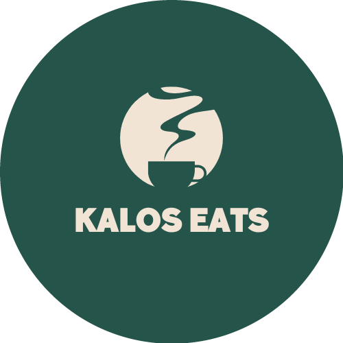
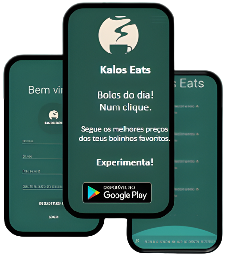

# Kalos Eats

Kalos Eats is an Android application that works similarly to TheFork.
 In the app, you can find several establishments, whether them being restaurants or bars or coffee shops.
  On the website, the establishment owner can apply for the app by delivering some details of themselves and their establishment.
 After the application has been done, there will have to be checked by the admin all the information, and update the app.

 

 

# How this project started?
I started to develop this app when I was in my final year studying mandatory school, and I needed to develop a project. 

I chose to do an app and a website because I was confident in my skills and also because I still couldn't decide if I wanted to code on web or mobile development. 

# Features
On the website, you'll find:
- Registration Form, for your establishment
- Explanation for the app
- List of advantages the app can deliver to your establishment

On the app, you'll find:
- List of several other establishments
- Location of other establishments
- Status of the establishment (To see what time it's open, and when it closes)

# Future implementations
I'm also looking to add:
- Translation option
- Some way to check if the establishment is open by the current time on the phone
- A search bar for the establishments
- In-depth screen for every establishment, with personal information
- The products that are sold on the establishment
- A screen to only show the products
- A search bar for the products
- A sorter for the price of the products
- A sorter for the distance of the establishments

# Screenshots

